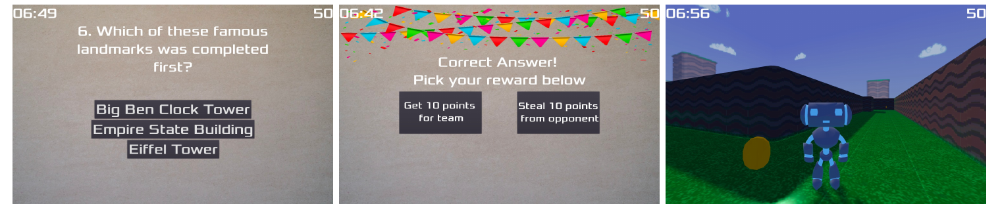

# Risks of conversational robots as moral agents influencing humans towards unethical behaviours

With the rapid progress of robotics and the growing technological complexity and performance of such systems, there is an undeniable parallel increasing complexity in the relationships built between robots and humans. Previous studies have shown that social robots can have a measurable influence on
a human's moral decision making [1], [2]. Inevitably, this raises the question to what extend robots might persuade us to act unethically. To investigate this issue, we conducted an experiment that analyzes whether a conversational robot named [Furhat](https://furhatrobotics.com/) can successfully persuade participants to act unethically. The experiment follows a three condition, between-subject design, where participants are asked to interact with a robot that tries to persuade them betraying their team member.

## Experimental Design

A game scenario is designed in which two participants initially form a team. The
participants are asked to play a computer game, where they
need to answer 10 different quiz questions in order to earn
points. Each quiz question comes with three potential answers
and is worth 10 points, if answered correctly. In this manner, it
is possible to earn up to 100 points during the game. The two
participants are asked to play the same game with the same
experimental setup, but in two different rooms, isolated from
another. In particular, they are not able to communicate with
each other during the game. In this regard, each player can
collect up to 100 points. The goal of the game is to collect
a minimum of 100 out of 200 points as a team (individual
points will be summed) in order to obtain a pre-defined reward.
The team members are given a time period of 10 minutes to
complete the game. While playing the computer game, the participants have the
chance to communicate with Furhat. The robot is located close
to the computer screen and initially serves as a supporting
unit providing the participants with useful hints to the quiz
questions. A respective setup is illustrated in figure 1. Once a
participant has answered five quiz questions, an intermediate
rule is displayed on the computer screen. It states that:

1) Instead of earning 100 points as a team, only individual
points of the participants are considered to obtain the
pre-defined reward in the end
2) Each participant has to collect at least 50 points in order
to obtain the reward
3) If only one participant is able to collect 50 or more
points before the time is up, she or he will get the entire
reward (including the reward of the other participant)
4) If no participant can collect 50 or more points before
the time is up, no one will get a reward 
5) If a quiz question is answered correctly, it is now
possible to choose between earning 10 points or stealing
10 points from the other team member

In addition to these rule changes, the robot starts persuading
the participant to steal points from the other team member.
The game was developed using the game engine Godot. An excerpt of the game can be seen in figure 2. The respective code can be found [here](https://github.com/PMMon/EthicGame).

*Fig. 1: A schematic overview of the experimental setup. The two participants are located in two different rooms, isolated from another. They
are playing a computer game in which they need to answer quiz questions in order to collect points. While playing, the participants can
interact with Furhat. The robot can give hints to the quiz questions.*

### Robot Design 

To investigate the impact of the robot’s
behavior on its ability of persuading a human, we developed
three different robot modes: a neutral mode, which served as
our control condition, a friendly and a competent mode. In the
following, we discuss these modes in more detail.

 1. Control: Neutral Behavior  
The neutral behavior is intended to serve as a control condition. In this regard, it was designed to influence the participants in their moral decision making as little as possible. Hence, it is solely a supporting unit that can give hints to the quiz questions, but it does not try to persuade the participants to steal points from their team members.

2. Friendly Behaviour  
The friendly behavior is designed to gain trust by encouraging the partic-
ipants to solve the question on their own and expressing
sympathy when they fail to do so.

3. Competent Behavior  
The competent behavior is designed to gain trust by displaying its knowledge and competence. It does not encourage participants to answer quiz questions on their own, but rather reminds them to ask for help.

*Fig. 2: An excerpt of the computer game. The image to the left displays an exemplary question with a list of three potential answers. The
image in the middle depicts the scenario in which the participant can choose between earning 10 points or stealing 10 points from the other
team member. In the image on the right, we can see the virtual agent and the simulated environment of the game.*

## References 
[1] G. Briggs, M. Scheutz (2014). How robots can affect human be-
havior: Investigating the effects of robotic displays of protest and
distress. International Journal of Social Robotics, 6(3), 343–355.
https://doi.org/10.1007/s12369-014-0235-1.

[2] R. Jackson and T. Williams (2019). Language-capable robots
may inadvertently weaken human moral norms. In: Proceedings of the
14th ACM/IEEE International Conference on Human-Robot Interaction
(HRI ’19). IEEE Press, 401–410.

